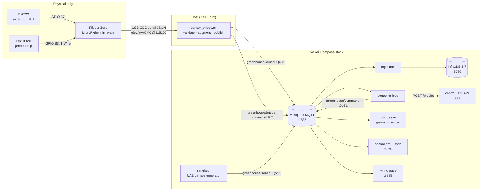
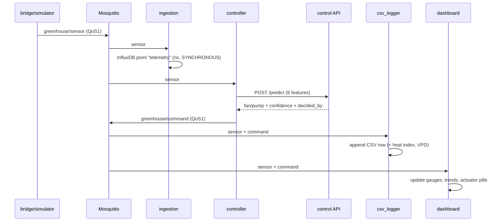
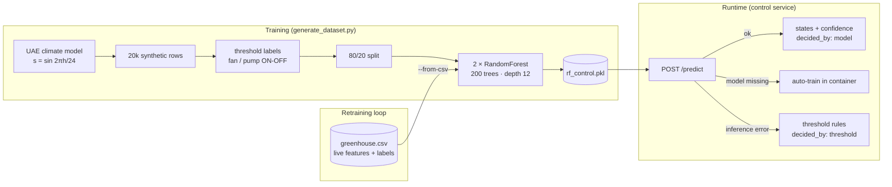
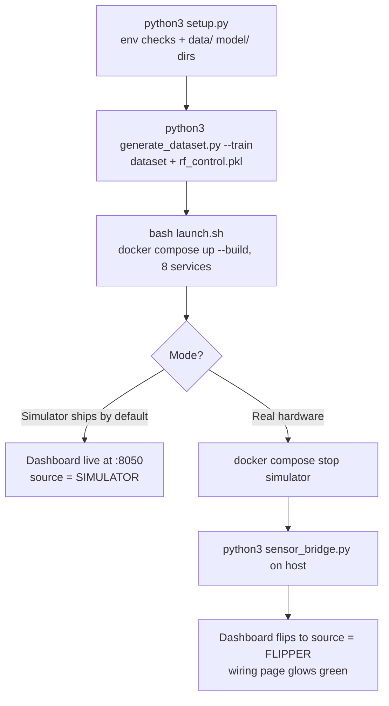

# MAD — Architecture & Data-Flow Deep Dive

Step-by-step documentation of every connection, flow, and AI component in the MAD greenhouse digital twin. Diagrams render natively on GitHub (Mermaid).

---

## 1. System overview



Two possible telemetry sources publish to the **same topic with the same schema** — the hardware path (Flipper + bridge) or the fallback simulator. Everything downstream is source-agnostic.

---

## 2. Hardware wiring (breadboard + Flipper Zero)

Both sensors share the breadboard power rails fed by the Flipper's 3V3 and GND pins. **A 4.7 kΩ pull-up to 3V3 is mandatory on each data line.**

| Sensor pin | Connects to | Wire colour (wiring page) |
|---|---|---|
| DHT22 VCC (1) | red rail ← Flipper 3V3 | red |
| DHT22 DATA (2) | Flipper GPIO **A7** + 4.7 kΩ → red rail | yellow |
| DHT22 GND (4) | blue rail ← Flipper GND | black |
| DS18B20 VDD | red rail ← Flipper 3V3 | red |
| DS18B20 DQ | Flipper GPIO **B3** + 4.7 kΩ → red rail | green |
| DS18B20 GND | blue rail ← Flipper GND | black |
| Flipper USB-C | host `/dev/ttyACM0` (pass through VirtualBox: Devices → USB → Flipper Zero) | — |

The **wiring page at http://localhost:8888** draws this exact breadboard schematic and animates it from live data: wires pulse green while telemetry flows, and the whole diagram flips to a red "waiting" state when it stops. It is the fastest end-to-end health check in the project.

---

## 3. Step-by-step: the life of one sensor reading

What happens every 5 seconds, from a physical measurement to a pixel on the dashboard:

**Step 1 — Firmware reads the sensors** (`sensor_flipper.py`, on the Flipper).
`dht.measure()` gets air temp + RH; the DS18B20 does a 12-bit 1-Wire conversion (~800 ms settle). If the probe is missing or fails, the cycle still emits with `ds_status: "fallback"`. One JSON line is printed to USB-CDC:

```json
{"temp_dht": 38.42, "humidity": 24.7, "temp_ds18": 38.15, "ds_status": "ok", "ts": 1720510800}
```

**Step 2 — The host bridge picks it up** (`sensor_bridge.py`).
It auto-detects the serial port (globs `/dev/ttyACM*`, `ttyUSB*`, `flipper*`), reads the line at 115,200 baud, and skips anything that isn't valid JSON (boot banners, partial frames).

**Step 3 — Validation.** Range checks per datasheet: DHT −40…80 °C, RH 0…100 %, DS18 −55…125 °C. Out-of-range frames are **dropped, never corrected**. If `temp_dht` and `temp_ds18` disagree by more than 5 °C, a cross-sensor warning is logged.

**Step 4 — Augmentation.** The DHT22/DS18B20 can't measure soil moisture, CO₂, or light. The bridge synthesises those three from the UAE climate model (same sinusoid as the simulator) so the 6-feature schema is always complete. Real sensors can replace this by editing one function.

**Step 5 — Publish.** The normalised payload goes to MQTT topic `greenhouse/sensor` at QoS 1, tagged `source: "flipper"`:

```json
{"ts": 1720510800.5, "temp_dht": 38.42, "temp_ds18": 38.15, "humidity": 24.7,
 "soil_moisture": 28.4, "co2": 610.2, "light_intensity": 8420.5,
 "source": "flipper", "ds_status": "ok"}
```

**Step 6 — Four subscribers react in parallel:**



- **ingestion** writes one `telemetry` point to InfluxDB (org `mad`, bucket `greenhouse`), tagged `source`/`ds_status`, nanosecond precision, synchronous write.
- **controller** builds the fixed feature vector and calls the control API (Step 7).
- **csv_logger** merges the reading with the *latest* command and appends a 17-column row including derived heat index and VPD. Append-only; row numbering survives restarts.
- **dashboard** and **wiring** update their live state (Sections 5–6).

**Step 7 — AI decision** (`control` service, FastAPI on :8000).
Both Random Forest classifiers run on the vector `[temp_dht, temp_ds18, humidity, soil_moisture, co2, light_intensity]`. Response:

```json
{"actuator": {"fan_state": "ON", "pump_state": "OFF"},
 "recommended_action": "open_fan",
 "confidence": {"fan": 0.985, "pump": 0.9925},
 "decided_by": "model"}
```

**Step 8 — Command republished.** The controller publishes the decision to `greenhouse/command` (QoS 1) — consumed by the dashboard (RF MODEL row) and csv_logger (labels for future retraining).

Total loop latency: well under a second; a new decision on every reading, stateless per message.

---

## 4. The AI pipeline



**Climate model** — every simulated variable derives from one diurnal sinusoid `s = sin(2πh/24)` plus Gaussian noise: air temp `7s+36`, humidity `12s+28`, soil `10s+32`, CO₂ `280s+420`, light `5500s+5500`, probe = air ± 0.4. The same formulas are used in the dataset generator, the simulator, and the bridge augmentation — so training and runtime distributions match.

**Threshold rules** (training labels **and** the runtime fallback), UAE desert calibration:

| Actuator | ON when | Why |
|---|---|---|
| Fan | `temp_dht ≥ 40 °C` OR `co2 ≥ 900 ppm` OR `humidity ≤ 20 %` | cooling, air exchange, humidity recovery |
| Pump | `soil_moisture ≤ 25 %` OR `temp_dht ≥ 45 °C` | irrigation + emergency heat-stress watering |

**Failure ladder** — model prediction → auto-train at startup if `rf_control.pkl` missing → deterministic thresholds if anything else fails. The degraded mode is always visible (`decided_by` field).

**Retraining from reality** — `python3 generate_dataset.py --train --from-csv mad_project/data/greenhouse.csv` fits the same pipeline on live logged history, since the CSV stores both the features and the actuator labels.

---

## 5. Dashboard (:8050) — panel by panel

Dark Kali/Flipper-themed Plotly Dash app. A background MQTT thread keeps a rolling 90-sample history of `greenhouse/sensor`, plus the latest `greenhouse/command` and `greenhouse/bridge`. The UI refreshes every 2 s (`dcc.Interval`). **Zero hardcoded readings** — if no sensor frame arrived in the last 12 s, every panel shows "WAITING FOR LIVE DATA".

| Panel | What it shows | How it works |
|---|---|---|
| **Top badges** | source (FLIPPER/SIMULATOR), flipper port, mqtt, influx, csv row count, UTC clock | source dot: green = flipper, grey = simulator; flipper badge comes from the retained `greenhouse/bridge` message (stale after 30 s), *not* from guessing |
| **Sensor telemetry** | 6 live gauges (air temp, probe temp, RH, soil, CO₂, light) | coloured band zones (ok/warn/alert) computed from the *current* thresholds; threshold needle drawn on each gauge |
| **Trends** | 4 sparklines over the last 90 samples | red dots mark threshold violations sample-by-sample |
| **Actuators · Random Forest** | FAN / IRRIGATION PUMP pills with the triggering cause (e.g. `AIR ≥ 40°C · CO₂ ≥ 900`) | pills follow the operator thresholds; the RF row below shows the model's `recommended_action`, `decided_by`, and per-classifier confidence from `greenhouse/command` |
| **Derived metrics** | heat index, VPD (ideal 0.8–1.2 kPa flagged), cross-sensor Δ | computed live; Δ turns amber > 1.5 °C, red > 5 °C |
| **Threshold override** | 5 sliders (fan temp/CO₂/humidity, pump soil/temp) | operator can retune actuator rules live; gauge bands, violation markers and pills all re-colour instantly |

---

## 6. Wiring page (:8888) — live connection status

FastAPI service with two endpoints:

- `GET /` — the animated breadboard + Flipper Zero schematic (Section 2). The page polls status every ~1.3 s; wires pulse green while data flows, red "waiting" otherwise.
- `GET /status` — the JSON the page (and you) can use for health checks:

```json
{"backend": true, "live": true, "mqtt": true, "source": "flipper",
 "age": 2.1, "msgs": 1284, "uptime": 5321,
 "flipper": {"connected": true, "port": "/dev/ttyACM0", "reason": "serial open"},
 "sensor": {"temp_dht": 38.4, "...": "...", "delta": 0.27},
 "command": {"fan_state": "ON", "pump_state": "OFF", "recommended_action": "open_fan"}}
```

**Staleness rules** — telemetry is `live` only if the last frame is < 12 s old; the bridge status is trusted only if < 30 s old. Flipper "connected" is primarily the retained `greenhouse/bridge` message (with MQTT Last Will flipping it to disconnected if the bridge dies or the cable is pulled); fresh frames tagged `source: "flipper"` also count as proof of life.

> Why this indirection? The dashboard and wiring page run **inside Docker and cannot see the host's `/dev/ttyACM0`**. The bridge's retained status message is the authoritative signal.

---

## 7. Every connection & port

| Component | Protocol / port | Direction | Notes |
|---|---|---|---|
| Flipper Zero → host | USB-CDC serial `/dev/ttyACM0` @ 115200 | one-way JSON lines | pass into VM via VirtualBox USB; needs `dialout` group |
| sensor_bridge / simulator → broker | MQTT `:1885` | publish `greenhouse/sensor` QoS 1 | bridge also publishes retained `greenhouse/bridge` + Last Will |
| controller → broker | MQTT `:1885` | sub `sensor`, pub `command` QoS 1 | |
| controller → control | HTTP `POST http://control:8000/predict` | request/response | 5 s timeout |
| ingestion → InfluxDB | HTTP `http://influxdb:8086` | synchronous writes | token `my-token`, org `mad`, bucket `greenhouse` |
| dashboard | HTTP `:8050` | browser UI | Dash, 2 s refresh |
| wiring | HTTP `:8888` | browser UI + `/status` JSON | 1.3 s poll |
| control API | HTTP `:8000` | `/predict`, `/health` | |
| ingestion API | internal | `/health`, `/stats` | not port-mapped by default |
| InfluxDB UI | HTTP `:8086` | browser | Flux explorer |
| MQTT (host access) | `localhost:1885` | debug | `mosquitto_sub -t "greenhouse/#" -v` |

---

## 8. Startup sequence & operating modes



Compose ordering: every service `depends_on` mosquitto (health-checked with `mosquitto_sub` against `$SYS/#`); controller also waits for control. `restart: unless-stopped` everywhere; broker and InfluxDB state persist in named volumes; `model/` and `data/` are bind-mounted so the host and containers share them.

**Mode switch is two commands with zero code changes** — stop the simulator, start the bridge. Downstream services never know the difference; only the `source` tag changes.
