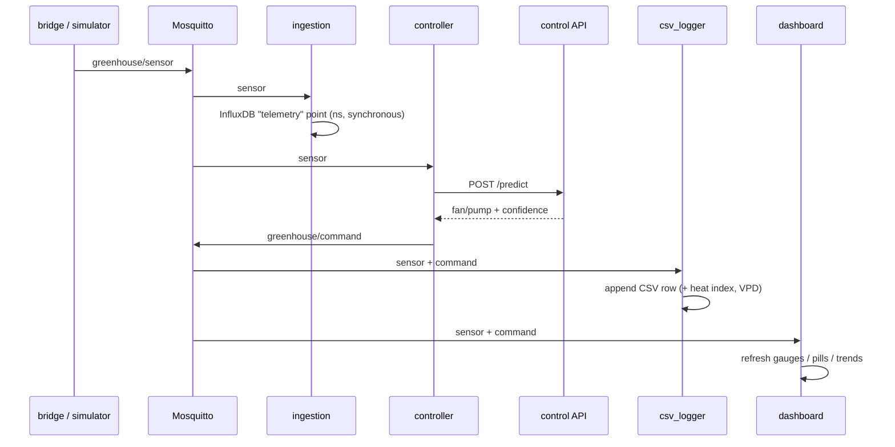

# Data Flow

## MQTT topics

| Topic | Payload | Publisher → Subscribers | Flags |
|---|---|---|---|
| `greenhouse/sensor` | 6-feature telemetry + `source`, `ds_status` | bridge **or** simulator → ingestion, controller, csv_logger, dashboard, wiring | QoS 1 |
| `greenhouse/command` | `fan_state`, `pump_state`, `recommended_action`, `confidence`, `decided_by` | controller → dashboard, csv_logger, wiring | QoS 1 |
| `greenhouse/bridge` | `connected`, `port`, `reason` | bridge → dashboard, wiring | QoS 1 · **retained** + **Last Will** |

## The life of one sensor reading (every 5 s)

1. **Firmware** reads DHT22 + DS18B20 and prints one JSON line over USB-CDC.
2. **Bridge** reads the line, skips non-JSON noise, **validates** ranges (drops bad frames), warns if the two temperature sensors disagree by > 5 °C.
3. **Bridge augments** soil/CO₂/light from the UAE climate model and **publishes** the complete payload to `greenhouse/sensor`:

```json
{"ts": 1720510800.5, "temp_dht": 38.42, "temp_ds18": 38.15, "humidity": 24.7,
 "soil_moisture": 28.4, "co2": 610.2, "light_intensity": 8420.5,
 "source": "flipper", "ds_status": "ok"}
```

4. **Four subscribers react in parallel:**



5. **Controller → AI**: builds the fixed feature vector, `POST http://control:8000/predict` (5 s timeout), then publishes the decision to `greenhouse/command`.
6. **csv_logger** stamps the reading with the **latest** command state and appends one 17-column row — features *and* labels, ready for retraining.
7. **Dashboard/wiring** update within their 2 s / 1.3 s refresh cycles.

Loop latency: sub-second. Stateless per message — every reading gets a fresh decision.

## The CSV schema (17 columns)

```
row_num, timestamp, date, time_utc,
temp_dht, temp_ds18, temp_delta,
humidity, soil_moisture, co2, light_intensity,
heat_index, vpd_kpa,
fan_state, pump_state,
sensor_source, ds_status
```

Derived on write: **heat index** (Steadman/NWS Rothfusz regression, °C), **VPD** (Tetens equation, kPa), **temp_delta** (cross-sensor |Δ|). Append-only; row numbering resumes across restarts.

## The bridge status pattern (retained + Last Will)

The dashboard and wiring page run inside Docker and **cannot** see the host's `/dev/ttyACM0`. So the bridge itself is the source of truth:

- On startup / port open / port loss, it publishes `greenhouse/bridge` with `retain=True`, so late subscribers immediately get the current state.
- It registers an MQTT **Last Will**: if the bridge process dies or the cable is yanked, the broker automatically publishes `{"connected": false, "reason": "bridge offline (last will)"}`.
- Consumers treat the status as stale after 30 s, and telemetry as stale after 12 s — a silent pipeline can never masquerade as a live one.

## InfluxDB data model

One measurement, `telemetry`: 6 float fields (the feature vector), tags `source` (`flipper`/`simulator`) and `ds_status`, nanosecond timestamps. Org `mad`, bucket `greenhouse`. Query it in the UI at :8086 or via Flux.
