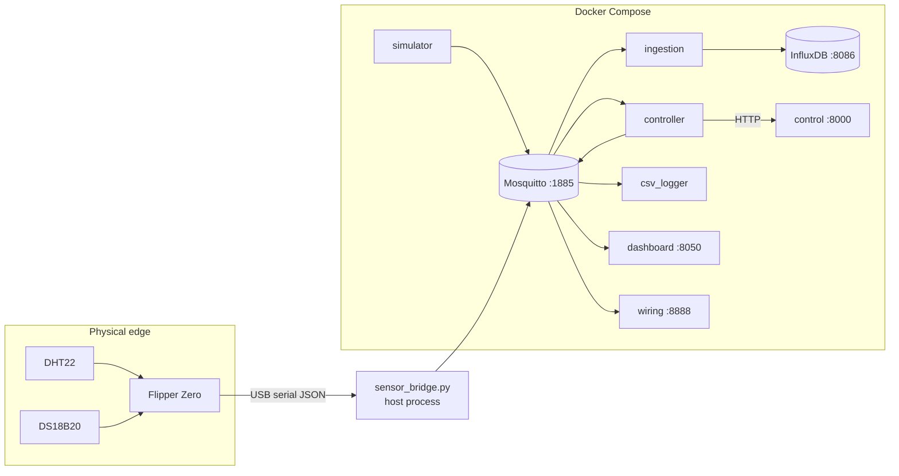

# System Architecture

MAD is a distributed system: 8 Docker services plus a host-side serial bridge, connected through an MQTT broker.

## The services

| Service | Role | Key tech |
|---|---|---|
| **mosquitto** | MQTT broker — the decoupling backbone. Port 1885, health-checked via `$SYS/#`. | Eclipse Mosquitto 2 |
| **influxdb** | Time-series store. Org `mad`, bucket `greenhouse`, persisted in a named volume. | InfluxDB 2.7 |
| **ingestion** | Subscribes `greenhouse/sensor`, writes each message as a `telemetry` point (ns precision, synchronous writes). Exposes `/health`, `/stats`. | FastAPI + paho-mqtt |
| **control** | Random Forest inference API — `POST /predict`. Auto-trains if the model file is missing; falls back to threshold rules on failure. | FastAPI + scikit-learn |
| **controller** | The closed loop: sensor message → `/predict` → publish `greenhouse/command`. | paho-mqtt + requests |
| **csv_logger** | Merges sensor + command streams into append-only `greenhouse.csv` with derived heat index and VPD. | paho-mqtt |
| **dashboard** | Live dark-theme UI: gauges, trends, actuator states, threshold override sliders. | Plotly Dash |
| **wiring** | Animated breadboard/Flipper schematic + `/status` JSON reflecting live pipeline state. | FastAPI |
| **simulator** | Fallback publisher of synthetic UAE-climate telemetry every 5 s (stop it when using real hardware). | paho-mqtt |

Host-side (not containerised): **sensor_bridge.py** — see [[Hardware and Wiring]].

## Design decisions worth knowing

**Pub/sub decoupling.** Producers and consumers never reference each other — only topics. Swapping the simulator for real hardware changes nothing downstream; the `source` tag in each payload is the only difference.

**One schema everywhere.** The 6-feature vector `[temp_dht, temp_ds18, humidity, soil_moisture, co2, light_intensity]` is fixed across firmware, bridge, simulator, dataset generator, model, API, and CSV. Never reorder it.

**Containers can't see serial ports.** The dashboard and wiring page run in Docker and cannot check `/dev/ttyACM0`. The bridge therefore publishes a **retained** `greenhouse/bridge` status message (with an MQTT Last Will) that acts as the authoritative "is the Flipper connected?" signal. See [[Data Flow]].

**Reliability ladder.** Model inference → auto-train at startup → deterministic threshold rules; DS18B20 → DHT22 fallback; simulator when no hardware. Every degraded mode is visible in the data (`decided_by`, `ds_status`, `source` fields) — nothing fails silently. 

**Reliability over throughput.** At one message per 5 s, ingestion uses synchronous InfluxDB writes and QoS 1 delivery everywhere — durability beats batching at this scale.

## Repository layout

See the [README](../blob/main/README.md) for the folder tree, and [docs/ARCHITECTURE.md](../blob/main/docs/ARCHITECTURE.md) for the in-repo version of this material with additional sequence diagrams.
