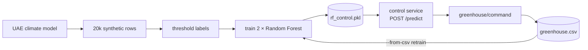

# AI and Machine Learning



## 1. The UAE climate model

Every synthetic variable derives from one diurnal sinusoid `s = sin(2πh/24)` (h = hour of day) plus Gaussian noise:

| Variable | Formula | Noise σ | Range implied |
|---|---|---|---|
| `temp_dht` (°C) | `7·s + 36` | 0.35 | ~29–43 |
| `humidity` (%RH) | `12·s + 28` | 1.5 | ~16–40 (clipped 0–100) |
| `soil_moisture` (%) | `10·s + 32` | 2.0 | ~22–42 |
| `co2` (ppm) | `280·s + 420` | 12 | ~140–700 |
| `light_intensity` (lux) | `5500·s + 5500` | 180 | ~0–11,000 |
| `temp_ds18` (°C) | `temp_dht` | 0.4 | tracks air temp |

The **same formulas** are used in three places — the dataset generator, the simulator, and the bridge's augmentation — so training data, simulated telemetry, and augmented live telemetry share one distribution.

## 2. Labels: the threshold rules (UAE desert calibration)

| Actuator | ON when | Purpose |
|---|---|---|
| **Fan** | `temp_dht ≥ 40 °C` OR `co2 ≥ 900 ppm` OR `humidity ≤ 20 %` | cooling, air exchange, humidity recovery |
| **Pump** | `soil_moisture ≤ 25 %` OR `temp_dht ≥ 45 °C` | irrigation + emergency heat-stress watering |

These deterministic rules label the synthetic dataset **and** serve as the runtime fallback if the model can't be used.

## 3. Training — `generate_dataset.py`

```bash
python3 generate_dataset.py --train                  # 20,000 rows, seed 42
python3 generate_dataset.py --train --rows 40000 --seed 7
python3 generate_dataset.py --train --from-csv mad_project/data/greenhouse.csv   # retrain on live data
```

- Two independent `RandomForestClassifier`s (fan, pump): `n_estimators=200`, `max_depth=12`, `n_jobs=-1`, `random_state=42`.
- 80/20 train–test split; test accuracy printed for both classifiers.
- Saved as a single joblib bundle `mad_project/model/rf_control.pkl`: `{"fan": clf, "pump": clf, "features": [...]}`.

> Since the initial labels are rule-derived, the first model essentially learns the rule surface (near-perfect accuracy). The value is the **retraining path**: `greenhouse.csv` logs live features *and* the actual actuator labels, so the same command retrains on reality.

## 4. Inference — the control service (:8000)

`POST /predict` with the 6 features (named fields or a raw `features` list):

```json
{"actuator": {"fan_state": "ON", "pump_state": "OFF"},
 "recommended_action": "open_fan",
 "confidence": {"fan": 0.985, "pump": 0.9925},
 "decided_by": "model"}
```

- **Confidence** = `predict_proba` max per classifier — surfaced on the dashboard with every decision.
- **`recommended_action`** ∈ `idle | open_fan | run_pump | open_fan+run_pump`.
- **Self-sufficient startup**: missing model file → the service trains one in-container at boot (`train.py`).
- **Graceful degradation**: any load/inference failure → threshold rules, flagged `decided_by: "threshold"`.
- `GET /health` reports whether the model is loaded.

## 5. The closed loop

The **controller** service subscribes to `greenhouse/sensor`, calls `/predict` for each reading, and republishes to `greenhouse/command`. The dashboard shows the model's recommendation alongside operator-tunable threshold pills; the csv_logger records the command as the label column of the next training set. Feature order is fixed everywhere: `[temp_dht, temp_ds18, humidity, soil_moisture, co2, light_intensity]`.
